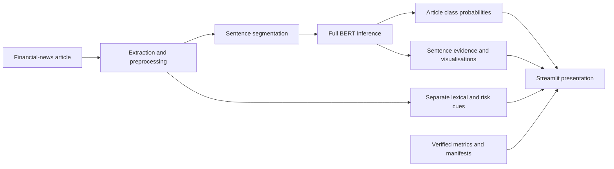

# Financial News Stock Intelligence

<p align="center">
  <strong>Public financial-news sentiment analysis with Full BERT evidence.</strong>
</p>

<p align="center">
  <a href="https://financial-news-stock-intelligence-v1.streamlit.app/"></a>
  
  
  
</p>

<p align="center">
  <a href="https://github.com/RuturajM31/financial-news-stock-intelligence/actions/workflows/ci.yml"></a>
</p>

## Overview

**Financial News Stock Intelligence** is a focused portfolio application for analysing financial-news language. It combines Full BERT article sentiment with sentence evidence, transparent lexical cues, verified experiment results, and a concise architecture view.

The public application has four pages:

| # | Page | Purpose |
|---:|---|---|
| 1 | Overview | Product summary and verified current experiment facts. |
| 2 | Analyze Article | URL, pasted-text, and sample workflows with Full BERT evidence. |
| 3 | Model Results | Current and historical experiment metrics, training history, and error analysis. |
| 4 | About / Architecture | The article-to-evidence workflow and its evidence boundaries. |

## Model and evidence

The public analysis workflow uses a fine-tuned Full BERT model based on `google-bert/bert-base-uncased`.

- Labels are fixed as **Bearish**, **Neutral**, and **Bullish**.
- Sentences are tokenized to a maximum of 128 tokens.
- Article probabilities are the arithmetic mean of sentence-level class probabilities.
- Positive, negative, and risk-related phrase matches are shown as separate lexical evidence; they do not replace or alter the Full BERT prediction.
- Model loading prefers the local final artifact, then the private Hugging Face repository, then the local Hugging Face cache. There is no silent lexical fallback.

Verified results shown in the app remain separate by run:

| Experiment | Accuracy | Macro-F1 |
|---|---:|---:|
| Full BERT current run | 90.93% | 0.8864 |
| Full BERT historical | 91.31% | 0.8900 |
| DistilBERT historical | 89.96% | 0.8779 |
| BERT-LoRA historical | 84.17% | 0.8154 |

## Current architecture



The Financial PhraseBank workflow preserves the original 3,453 sentences, removes five exact duplicates, and produces 3,448 records in a reproducible stratified split. Dataset and experiment evidence is retained in `artifacts/manifests/` and `reports/metrics/`.

## Repository guide

```text
app/                                      Streamlit entry point and four-page renderer
src/financial_news_intelligence/models/  Full BERT inference, visualisation, and experiment loading
src/financial_news_intelligence/data/    Financial PhraseBank acquisition and reproducible split
artifacts/manifests/                      Dataset and current-run evidence contracts
reports/metrics/                          Verified current and historical experiment metrics
scripts/                                  Full BERT training, smoke, and benchmark helpers
tests/                                    Active public-app, Full BERT, and PhraseBank tests
```

For a detailed guide, see [docs/CODEBASE_GUIDE.md](docs/CODEBASE_GUIDE.md). For model operations, see [docs/FULL_BERT_RUNBOOK.md](docs/FULL_BERT_RUNBOOK.md).

## Run locally

Create a Python environment and install the public-app requirements:

```powershell
python -m venv .venv
.\.venv\Scripts\python.exe -m pip install --upgrade pip
.\.venv\Scripts\python.exe -m pip install -r app\requirements.txt
.\.venv\Scripts\python.exe -m streamlit run app\streamlit_app.py
```

The entry point adds the repository `src/` directory automatically. If `artifacts/models/bert_sentiment/final_model/` is unavailable, configure a read-only `HF_TOKEN` for access to the private model repository before running analysis.

## Streamlit Community Cloud

The supported deployment is Streamlit Community Cloud using `app/streamlit_app.py` and `app/requirements.txt`. The deployment steps and secret guidance are in [deployment/streamlit-community-cloud/README.md](deployment/streamlit-community-cloud/README.md).

## Verification

For the retained local suite:

```powershell
.\.venv-bert\Scripts\python.exe -m pytest
.\.venv-bert\Scripts\python.exe scripts\benchmark_full_bert_inference.py
```

The final local model artifact is intentionally ignored by Git. The repository keeps the metrics, manifests, and source code needed to explain the public results without committing local model weights or credentials.

## Public demonstration boundary

This project analyses financial-news text. It does not predict stock prices, forecast returns, or provide investment advice.

<p align="center">
  <strong>Ruturaj Mokashi</strong><br>
  Financial-news sentiment analysis · Full BERT · Streamlit
</p>
