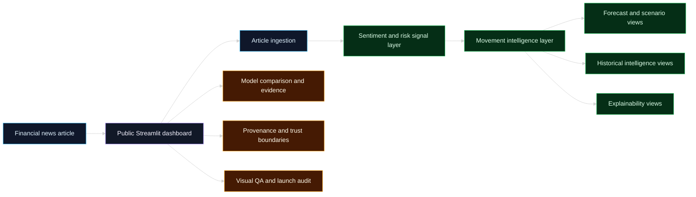
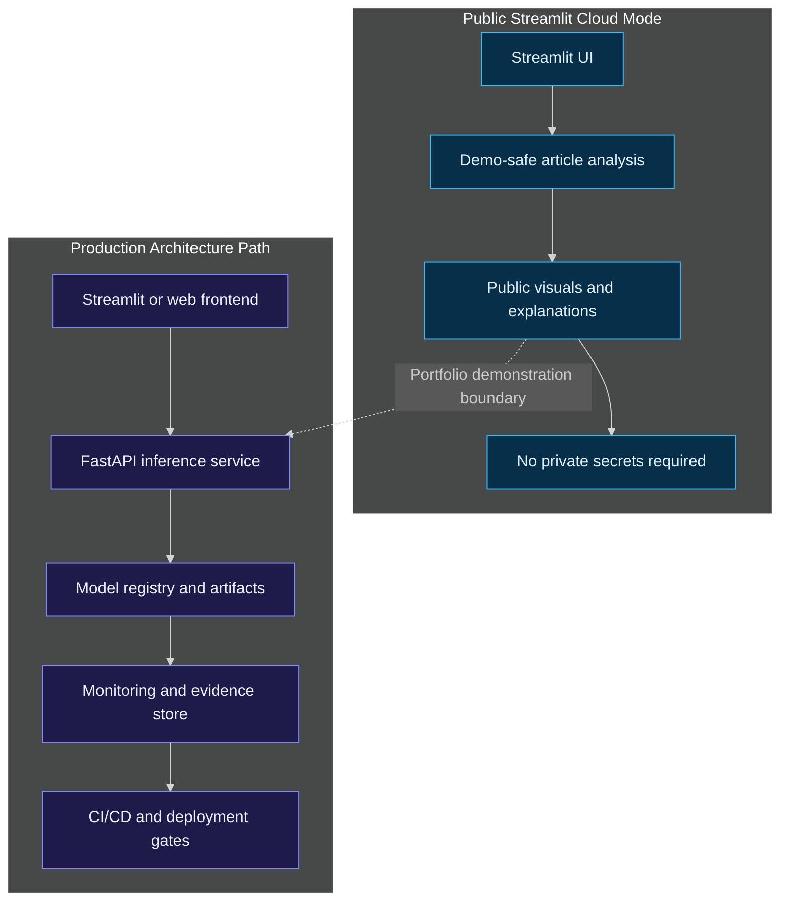
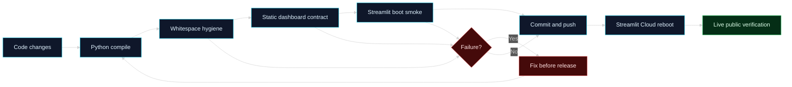

# Financial News Stock Intelligence

<p align="center">
  <strong>
    Public financial AI dashboard for article intelligence, movement signals, forecasts,
    scenarios, explainability, evidence, provenance, architecture, and deployment QA.
  </strong>
</p>

<p align="center">
  <a href="https://financial-news-stock-intelligence.streamlit.app/">
    
  </a>
  
  
  
  
  
  
</p>

<p align="center">
  <a href="https://github.com/RuturajM31/financial-news-stock-intelligence/actions/workflows/ci.yml">
    
  </a>
</p>

<p align="center">
  <a href="https://financial-news-stock-intelligence.streamlit.app/"><strong>Open the live dashboard</strong></a>
</p>

---

## Executive Summary

**Financial News Stock Intelligence** is an end-to-end public AI dashboard that turns financial-news articles into structured intelligence.

The project demonstrates how a financial AI product can move beyond a simple sentiment label and show:

- article-level signal analysis;
- forecast and scenario reasoning;
- historical event comparison;
- explainability and model evidence;
- provenance and trust boundaries;
- architecture and deployment readiness;
- final public dashboard QA.

The live Streamlit dashboard is designed as a **portfolio-grade AI product**, not only a model demo.

---

## Live Dashboard

| Item | Value |
|---|---|
| Public app | [https://financial-news-stock-intelligence.streamlit.app/](https://financial-news-stock-intelligence.streamlit.app/) |
| Repository | [github.com/RuturajM31/financial-news-stock-intelligence](https://github.com/RuturajM31/financial-news-stock-intelligence) |
| Deployment branch | `project-foundation-streamlit-closure` |
| Final verified commit | `6665adb` |
| Dashboard status | `13 / 13 pages passed` |
| Live verification | `Passed` |

---

## What the Project Solves

Financial news is noisy, fast-moving, and difficult to evaluate consistently. A headline can look positive while still carrying risk, uncertainty, or weak movement pressure.

This project converts financial-news text into a structured dashboard experience:

| Layer | Purpose |
|---|---|
| Article intelligence | Extract article context and convert it into readable signals. |
| Sentiment and movement | Separate language tone from likely market-direction pressure. |
| Forecasts | Show forward-looking scenarios and probability mixes. |
| Historical intelligence | Compare current-style events with comparable historical examples. |
| Explainability | Show why a model-style conclusion is produced. |
| Evidence and QA | Display training, validation, testing, provenance, and launch readiness. |
| Architecture | Show how the public app maps to a production-style AI system. |

---

## Public Dashboard Pages

| # | Page | Purpose | Status |
|---:|---|---|---|
| 1 | Executive Overview | Product landing page and reviewer overview | Passed |
| 2 | Analyze Article | Article URL, upload/paste, sentiment and movement analysis | Passed |
| 3 | Forecasts | Forecast calendar, fan chart, probabilities, driver impact | Passed |
| 4 | Historical Intelligence | Comparable events, timelines, return distributions | Passed |
| 5 | Explainability | Token impact, sentence impact, waterfall, evidence table | Passed |
| 6 | Scenario Analysis | Upside/base/downside cases and stress testing | Passed |
| 7 | Model Comparison | Champion model selection and tradeoff analysis | Passed |
| 8 | Model Training / Evidence | Training, validation, testing, and evidence board | Passed |
| 9 | Provenance | Source verification, trust boundaries, disclaimers | Passed |
| 10 | Architecture / System Design | Public vs production architecture and CI/CD gates | Passed |
| 11 | 3D Intelligence | 3D signal cube, decision surface, trajectory, fallback | Passed |
| 12 | About / Project Purpose | Privacy-safe portfolio story and reviewer guide | Passed |
| 13 | Visual QA / Page Audit | Final public launch QA cockpit | Passed |

---

## System Architecture



---

## Public vs Production Design



---

## CI/CD and QA Closure Flow



---

## Technical Highlights

| Area | Implementation Focus |
|---|---|
| UI product | Streamlit multi-page public dashboard with routed sidebar navigation. |
| Visualization | Plotly charts, 3D signal views, evidence boards, QA cockpit, Mermaid diagrams. |
| NLP reasoning | Financial-news text converted into sentiment, risk, movement, and explanation layers. |
| Forecasting UX | Forecast calendar, fan charts, probability mix, scenario stress testing. |
| Explainability | Token impact, sentence impact, waterfall reasoning, evidence tables. |
| MLOps evidence | Training/evidence pages, validation boards, quality gates, reproducibility framing. |
| Provenance | Source verification, trust boundaries, public-demo disclaimers. |
| Deployment | Public Streamlit Cloud deployment with final live verification. |

---

## Final QA Status

The public dashboard closure passed the following release gates:

| Gate | Result |
|---|---|
| Python compile | Passed |
| Git whitespace check | Passed |
| Static dashboard contract | Passed |
| Streamlit boot smoke | Passed |
| 13 public page contracts | Passed |
| Visual QA / Page Audit live check | Passed |
| Public deployment verification | Passed |

Final verified deployment commit:

```text
6665adb Finalize public dashboard QA audit and closure
```

---

## Repository Hygiene

This repository follows these hygiene rules:

- keep local runner helpers uncommitted;
- avoid committing secrets, credentials, local caches, or private artifacts;
- keep public mode independent from private infrastructure;
- document public-demo boundaries clearly;
- use route and page contracts before final dashboard closure;
- verify live deployment after push and reboot.

---

## How to Run Locally

```bash
git clone https://github.com/RuturajM31/financial-news-stock-intelligence.git
cd financial-news-stock-intelligence
python3 -m venv .venv
source .venv/bin/activate
pip install -r app/requirements.txt
python3 -m streamlit run app/public_cloud_app.py
```

Use the live deployed app as the source of truth for public verification.

---

## Public Demonstration Boundary

This dashboard is a public portfolio demonstration. It is designed to show product thinking, applied ML reasoning, visual intelligence, MLOps evidence, architecture, and deployment readiness.

It is **not investment advice**, trading instruction, or a guarantee of future market movement.

---

## Reviewer Path

For a fast review:

1. Open the live dashboard.
2. Start with **Executive Overview**.
3. Test an article in **Analyze Article**.
4. Review **Forecasts**, **Explainability**, and **Scenario Analysis**.
5. Check **Model Training / Evidence** and **Provenance**.
6. Review **Architecture / System Design**.
7. End with **Visual QA / Page Audit**.

---

<p align="center">
  <strong>Financial News Stock Intelligence</strong><br>
  Public financial AI dashboard · Streamlit · Plotly · MLOps evidence · Live deployment QA
</p>
