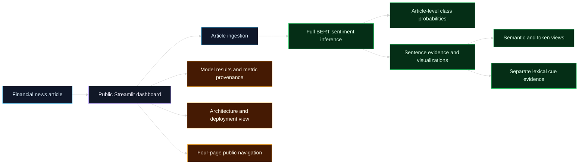
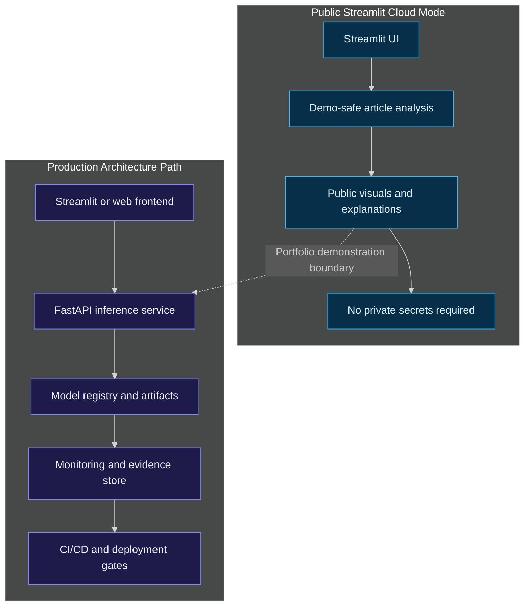
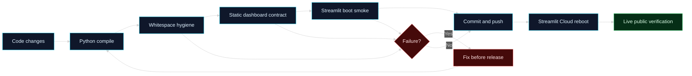

# Financial News Stock Intelligence

<p align="center">
  <strong>
    Public financial AI dashboard for Full BERT sentiment analysis, sentence evidence,
    lexical cues, model results, architecture, and deployment readiness.
  </strong>
</p>

<p align="center">
  <a href="https://financial-news-stock-intelligence-v1.streamlit.app/">
    
  </a>
  
  
  
  
  
  
</p>

<p align="center">
  <a href="https://github.com/RuturajM31/financial-news-stock-intelligence/actions/workflows/ci.yml">
    
  </a>
</p>

<p align="center">
  <a href="https://financial-news-stock-intelligence-v1.streamlit.app/"><strong>Open the live dashboard</strong></a>
</p>

---

## Executive Summary

**Financial News Stock Intelligence** is an end-to-end public AI dashboard that turns financial-news articles into structured intelligence.

The project demonstrates how a financial AI product can move beyond a simple sentiment label and show:

- article-level Full BERT sentiment analysis;
- sentence-level model evidence and visualizations;
- separate lexical and risk-cue evidence;
- verified current and historical experiment results;
- provenance and trust boundaries;
- architecture and deployment readiness;
- four-page public dashboard navigation.

The live Streamlit dashboard is designed as a **portfolio-grade AI product**, not only a model demo.

---

## Live Dashboard

| Item | Value |
|---|---|
| Public app | [https://financial-news-stock-intelligence-v1.streamlit.app/](https://financial-news-stock-intelligence-v1.streamlit.app/) |
| Repository | [github.com/RuturajM31/financial-news-stock-intelligence](https://github.com/RuturajM31/financial-news-stock-intelligence) |
| Deployment branch | `main` |
| Previous verified commit | `6665adb` |
| Dashboard status | `4 active pages` |
| Live verification | `Live` |

---

## What the Project Solves

Financial news is noisy, fast-moving, and difficult to evaluate consistently. A headline can look positive while still carrying risk, uncertainty, or weak movement pressure.

This project converts financial-news text into a structured dashboard experience:

| Layer | Purpose |
|---|---|
| Article intelligence | Extract article context and prepare it for analysis. |
| Sentiment analysis | Use Full BERT for sentence-level and article-level financial-news sentiment. |
| Evidence visuals | Show probabilities, a heatmap, sentiment journey, semantic map, and token views. |
| Lexical cues | Keep positive, negative, and risk language as separate explanatory evidence. |
| Model results | Present verified current and historical experiment metrics. |
| Evidence and QA | Display dataset and metric provenance with trust boundaries. |
| Architecture | Show the article-to-evidence workflow and deployment components. |

---

## Public Dashboard Pages

| # | Page | Purpose | Status |
|---:|---|---|---|
| 1 | Overview | Product landing page and current project overview | Active |
| 2 | Analyze Article | URL, manual, and sample input with Full BERT evidence | Active |
| 3 | Model Results | Current and historical experiments, metrics, and provenance | Active |
| 4 | About / Architecture | Article-to-evidence workflow and deployment architecture | Active |

---

## System Architecture



---

## Public vs Production Design



---

## CI/CD and QA Closure Flow



---

## Technical Highlights

| Area | Implementation Focus |
|---|---|
| UI product | Four-page Streamlit public dashboard with routed sidebar navigation. |
| Visualization | Plotly probability charts, sentiment heatmaps, journeys, semantic maps, and token views. |
| NLP reasoning | Full BERT article sentiment with lexical cues shown as separate explanatory evidence. |
| Article analysis UX | URL extraction, manual input, a presentation sample, and a highlighted article reader. |
| Evidence views | Sentence evidence, WordPiece token landscape, contextual token network, and lexical cues. |
| MLOps evidence | Current and historical experiment comparison, validation artifacts, and reproducibility framing. |
| Provenance | Dataset and metric provenance, trust boundaries, and public-demo disclaimers. |
| Deployment | Public Streamlit Cloud deployment with the active four-page application. |

---

## Final QA Status

The public dashboard closure passed the following release gates:

| Gate | Result |
|---|---|
| Python compile | Passed |
| Git whitespace check | Passed |
| Static dashboard contract | Passed |
| Streamlit boot smoke | Passed |
| 4 active public page contracts | Passed |
| Route and navigation check | Passed |
| Public deployment verification | Passed |

Previous verified deployment commit:

```text
6665adb Finalize public dashboard QA audit and closure
```

---

## Repository Hygiene

This repository follows these hygiene rules:

- keep local runner helpers uncommitted;
- avoid committing secrets, credentials, local caches, or private artifacts;
- keep public mode independent from private infrastructure;
- document public-demo boundaries clearly;
- use route and page contracts before final dashboard closure;
- verify live deployment after push and reboot.

---

## How to Run Locally

```bash
git clone https://github.com/RuturajM31/financial-news-stock-intelligence.git
cd financial-news-stock-intelligence
python3 -m venv .venv
source .venv/bin/activate
pip install -r app/requirements.txt
PYTHONPATH=src python3 -m streamlit run app/streamlit_app.py
```

Use the live deployed app as the source of truth for public verification.

---

## Public Demonstration Boundary

This dashboard is a public portfolio demonstration. It is designed to show product thinking, applied ML reasoning, visual intelligence, MLOps evidence, architecture, and deployment readiness.

It is **not investment advice**, trading instruction, or a guarantee of future market movement.

---

## Reviewer Path

For a fast review:

1. Open the live dashboard.
2. Start with **Overview**.
3. Test an article in **Analyze Article**.
4. Review **Model Results**.
5. Review **About / Architecture**.

---

<p align="center">
  <strong>Financial News Stock Intelligence</strong><br>
  Public financial AI dashboard · Streamlit · Plotly · MLOps evidence · Live deployment QA
</p>

## Financial News Sentiment Analyzer release

The public application uses Full BERT as its primary inference model to classify financial-news language as Bearish, Neutral, or Bullish and expose sentence-level evidence. It is based on `google-bert/bert-base-uncased`, uses a maximum sequence length of 128, and has approximately 109.5 million parameters. Article sentiment is the arithmetic mean of sentence-level Full BERT probabilities; lexical cues are separate explanatory evidence only.

Model loading prioritizes a local artifact, then the private Hugging Face repository, then its local cache. There is no silent lexical fallback. The current reproduced run reached 90.93% accuracy and 0.8864 macro-F1. Historical results shown separately are Full BERT at 91.31% accuracy and 0.8900 macro-F1, DistilBERT at 89.96% and 0.8779, and BERT-LoRA at 84.17% and 0.8154.

The four public pages are Overview, Analyze Article, Model Results, and About / Architecture.

Local launch:

    $env:PYTHONPATH = "src"
    .venv-bert\Scripts\python.exe -m streamlit run app\streamlit_app.py --server.port 8502

Run tests with .venv-bert\Scripts\python.exe -m pytest.

Streamlit Community Cloud uses app/requirements.txt. When a local artifact is unavailable, it retrieves the private repository `ruturajmokashi/financial-news-full-bert` with a deployment-only Hugging Face READ token. The application never presents lexical scoring as Full BERT output.

Author: Ruturaj Mokashi
